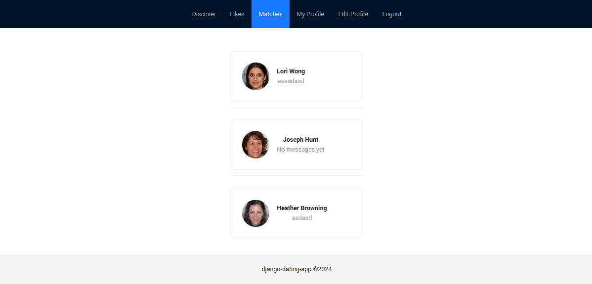

# Django Dating App

[](https://www.python.org/)
[](https://www.djangoproject.com/)
[](https://www.django-rest-framework.org/)
[](https://www.mysql.com/)
[](https://redis.io/)
[](https://reactjs.org/)
[](https://redux.js.org/)
[](https://ant.design/)
[](https://www.docker.com/)


Simple Dating App made with Django Rest Framework, MySQL, Redis, React, Redux, and Ant Design.

I made this app in one week to improve my skills working with Django.




## Install and Setup

To start first install [Docker](https://docs.docker.com/engine/install/) on the system you are using

To run web application run the following docker commands
```
docker compose up -d --build
docker compose exec web python3 manage.py makemigrations
docker compose exec web python3 manage.py migrate
```

In a Seperate Terminal run
```
npm install .
```
```
npm run start
```


This will start a simple react + ant design frontend used to test the site.

To create a superuser for the site run the following command:
```
docker compose exec web python3 manage.py createsuperuser
```

<!-- To run api endpoint test cases run
```
docker compose exec web python3 manage.py test
``` -->


## Populating the site with Fake Data 

To add Dummy Users to the system run
```
docker compose exec web python3 manage.py createdummyusers
```
This will create 10 dummy users with 1 random profile picture each.
Script uses https://thispersondoesnotexist.com which uses styleGAN2 to generate dummy pictures for users.


To add Dummy Ratings to the system run
```
docker compose exec web python3 manage.py createdummyratings --num_ratings 100
```
This will create 100 dummy ratings for the dummy users you added


## TODO:

- [x] Improve UI of login page
- [ ] Add user registration page
- [ ] Implement Frontend to notify users of matches and likes (notification system)
- [ ] Write comprehensive unit tests for backend
- [ ] Add more profile options such as prompts and interests
- [ ] Add profile completeness metric to unincentivise empty profiles
- [ ] Use image-to-text model to add extra information to users profiles based on active pictures
- [ ] Limit number of user picture uploads for profile
- [ ] Add drag and drop to re-order pictures on frontend
- [ ] Add pagination to list views and modify frontend to handle changes
- [ ] Create machine learning driven model for user recommendation engine
- [ ] Add ability to ban / suspend users
- [ ] Implement Spam / Bot / NSFW Detection Algorithms to avoid spam and unwanted content
- [ ] Add report functionality to allow users to report fradulent activity on the site
- [ ] Add support for Twilio API for phone authentication
- [ ] Configure setup for production server
- [ ] Configure support for cloud services such as AWS, Digital Ocean, Heroku, Google Cloud etc


## Contribute

If you are interested in this project and would like to contribute please reach out!  **Email:** [erickill@usc.edu](mailto:erickill@usc.edu)


## License

[MIT](LICENSE.txt)
